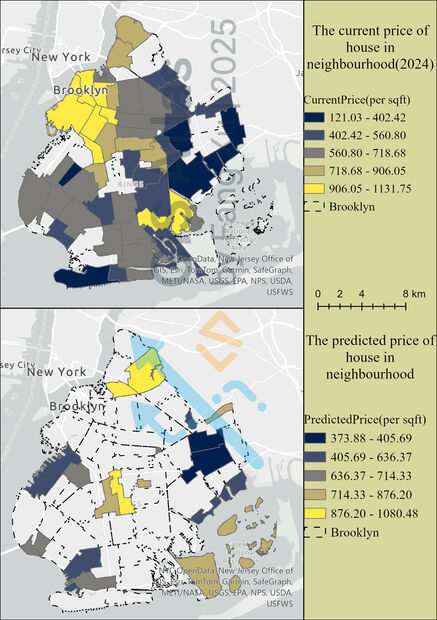

## GIS + AI: NYC Housing Price Forecasting

> **Purpose**: case that fuses **ArcGIS Pro** spatial processing with **Python/ML** to quantify factor impacts and forecast housing prices for decision support.

### Executive Summary
- **What you get**: seven GIS factors mapped at neighborhood/parcel scale, a transparent ML pipeline (correlation + prediction), and decision‑ready maps/tables.
- **Who it’s for**: planning, real estate, policy, and analytics teams needing evidence‑based siting and pricing.

## Table of Contents

- [Highlights](#highlights)
- [Base Map Project: NYC GIS Map Gallery — Portfolio Case Study](https://github.com/Fang-M-Xu/gis-map-gallery)
- [Tech Stack](#tech-stack)
- [Quick Preview](#quick-preview)
- [Analysis Results](#analysis-results)
- [License & Data Notice](#license--data-notice)

### Highlights
- **Seven spatial factors**: 
    - `POI_Count`: number of landmarks(museum,park,university...) in a neighbourhood of Brooklyn,
    - `Bus_Count`: number of bus stops in a neighbourhood of Brooklyn, 
    - `Pop_Density`:density of population in a neighbourhood of Brooklyn, 
    - `Road_Density`:density of roads in a neighbourhood of Brooklyn, 
    - `Length_Close_Facility`: length from centre of neighbourhood to mainRoad, 
    - `Park_Service_Min`: service area that the park covered, 
    - `Univ_Service_Min`:service area that the university covered.
- **Analytical rigor**: OLS with coefficients/p‑values + Random Forest with feature importance, plus SHAP for global & local explanations.
- **Actionable outputs**: predicted price surface by parcel, factor importance ranking, local SHAP maps, and short‑listed candidate areas.

### Tech Stack
- **GIS**: ArcGIS Pro (Spatial Join, Network Analyst, Field Calculator).
- **Python**: `pandas`, `numpy`, `scikit-learn`, `shap`, `geopandas`, `matplotlib`.

### Quick Preview
  

— *Current price vs predicted price by RF.*

  

— *OLS Coefficients with Significance vs Random Forest Feature Importance.*

### Analysis Results
#### 1.Key Influencing Factors
- Both OLS and Random Forest results indicate that Length_Close_Facility, POI_Count, and Population Density are the most important factors affecting housing prices.
- OLS coefficients show that POI_Count, Road_Density, and Univ_Service_Min have a positive impact on housing prices, while Length_Close_Facility and Pop_Density are negatively correlated (with statistically significant p-values).
#### 2.Current vs. Predicted Price Spatial Patterns
- High-price areas are concentrated in the northwestern and parts of the central core of Brooklyn, while low-price areas are mainly located in the southern and eastern peripheries.
- The prediction suggests that high-price zones are likely to expand toward the north and parts of the east, with some low-price areas expected to experience price growth.
#### 3.Investment and Planning Insights
- Areas with high accessibility, abundant landmarks(POIs), and moderate population density have strong potential for future appreciation.
- Peripheral low-price areas may become emerging hotspots if infrastructure and facilities improve, and should be closely monitored.

> 📂 Detailed reports:
> - [Map process](maps/README.md)
> - [Price predict](analysis/README.md)

### License & Data Notice
- **Data sources:** [NYC Open Data](https://opendata.cityofnewyork.us/), [NYC Department of City Planning — Neighborhood Tabulation Areas datasets](https://www.nyc.gov/content/planning/pages/resources/datasets/neighborhood-tabulation),  [Kaggle](https://www.kaggle.com/),and [US Census Bureau](https://www.census.gov/en.html).
- Maps and figures in this repository are derived from the above public datasets and are provided **for demonstration/portfolio purposes only**. **Not for commercial use.**
- Before reuse, review and comply with each dataset’s license and terms; retain source attribution on derived outputs.
- No affiliation or endorsement by NYC agencies or Kaggle is implied.
- All maps and data in this repository are created with **properly licensed ArcGIS Pro** software.

### Copyright & Usage
- All finished maps, documentation, and derivative files in this repository are copyrighted by the project author(s) and **prohibited from commercial use**. For personal, organizational, or academic reference only.
- Please attribute this project and data sources when quoting.
- Do **not** use this repository content in violation of laws, regulations, or third-party rights.
