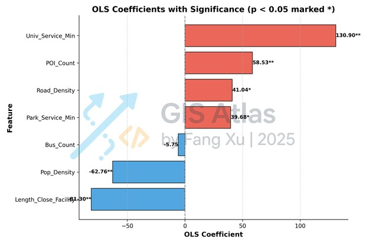
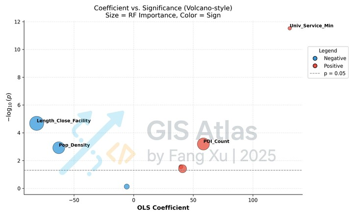
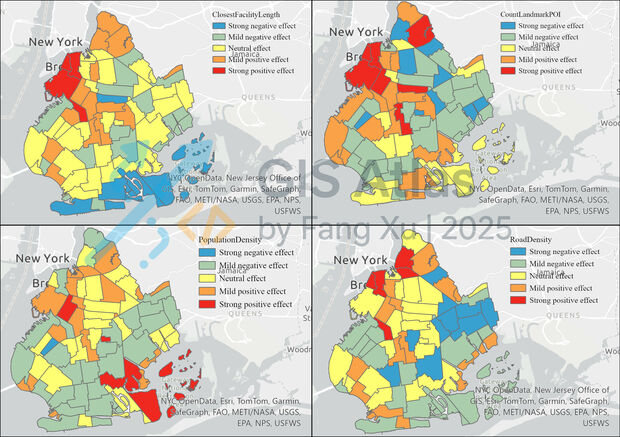

##  Python ML: Correlation & Price Forecasting

> **Goal**: quantify factor impacts and predict neighbourhood prices with transparent metrics and explainability.

### Data Preparation
- **From GIS**: export the seven‑factor table as `features.csv` (`ntacode` + factors).
- **From prices**: aggregate `price_per_sqft` by tractcode and **join** to features → `dataset.csv`.
- **Splits**: `train_set.csv`, `val_set.csv`, `test_set.csv`.

### What the Scripts Do
- **01 PrepareData.py**: loads CSV, coerces types (e.g., `Census Tract` to string), drops nulls/dupes, standardizes numeric features for OLS.
- **02 TrainModel.py**: fits **OLS** (with coefficients & p‑values) and **Random Forest** (with permutation or impurity importances), computes cross‑val metrics, and runs **SHAP** for global importance and parcel‑level contributions; saves `ols_summary.txt`, `model_comparison_results.csv`, and `shap_by_parcel.csv`.
- **03 PredictProcess.py**: with predict export, generates parcel‑level predictions, joins IDs, and exports `predicted_price_by_parcel.csv` and `test_predictions.csv` (with errors).

### Outputs
- `model_comparison_results.csv` — global importance (OLS coeffs, RF importance, SHAP mean |value|).
- `shap_by_parcel.csv` — local SHAP values per factor per parcel.
- `predicted_price_by_parcel.csv` — predicted price per parcel.
- `ols_summary.txt` — OLS regression report.
- `feature_importance.png` — bar chart for RF vs SHAP.

### Visualizing in ArcGIS Pro
- **Local effects**: Join `shap_by_parcel.csv` back to parcels on `ntacode`, symbolize a single factor’s SHAP field with a diverging ramp (red = push up, blue = pull down; center = 0).
- **Predictions**: Join `predicted_price_by_parcel.csv`, symbolize with a sequential ramp.

### Analysis result

 — *RF vs SHAP bar chart.*

##

 — *Snippet of OLS summary (coefficients & p‑values).*

##

  — *OLS Coefficients and Significance with RF Importance.*

##

 — *Local SHAP map for top four factors.*

### Analysis Reports
#### 1.Key Factor Importance
- RF and SHAP rankings highlight Length_Close_Facility, POI_Count, and Pop_Density as top contributors to housing price prediction, with Road_Density also notable.

#### 2.OLS Coefficient Insights
- Positive significant effects: Univ_Service_Min, POI_Count, Road_Density, Park_Service_Min.
- Negative significant effects: Length_Close_Facility, Pop_Density.
- This suggests accessibility to universities, landmark distribution, and road infrastructure tend to raise prices, while greater distance to mainroad and higher population density tend to lower them.

#### 3.Coefficient–Significance (Volcano Plot)
- The most statistically significant and high-impact factors are Univ_Service_Min (positive) and Length_Close_Facility (negative), followed by POI_Count and Pop_Density.

#### 4.Spatial Patterns of Local Effects
- Length_Close_Facility: Strong negative impact in southern and southeastern Brooklyn, strong positive in some northwestern zones.
- POI_Count: Positive effects cluster in central and northern neighborhoods, with negative effects in select peripheries.
- Pop_Density: Positive effects in certain southern and northeastern zones; negative in northwest and central cores.
- Road_Density: Mixed patterns, with strong positives in north-central areas and negatives in peripheral regions.
