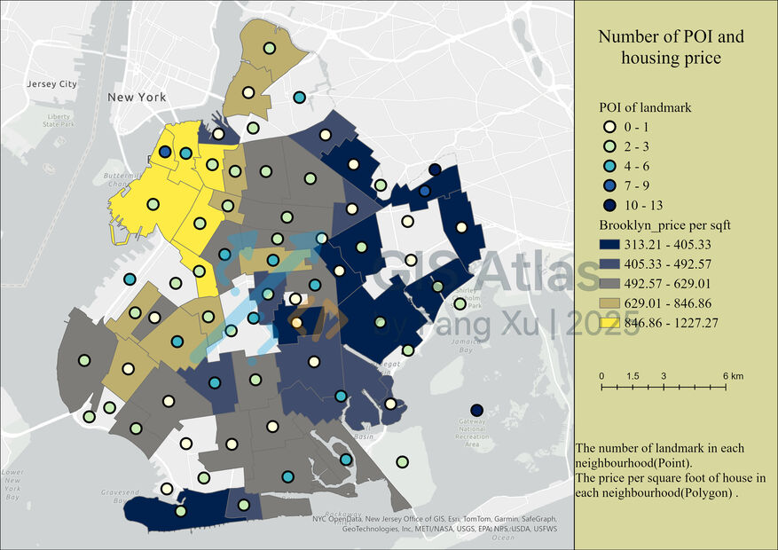
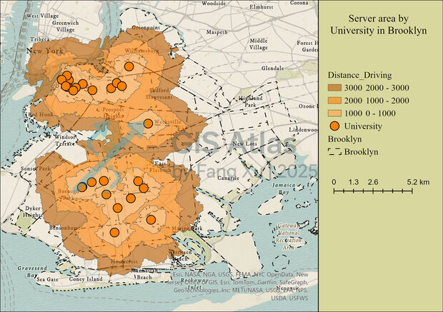

## ArcGIS Pro: Seven‑Factor Mapping Workflow
>**Goal**: produce reproducible layers/fields for the seven factors and export high‑quality maps for the gallery and the ML pipeline.

### Inputs
- **Boundaries**: NYC neighborhoods/tracts (polygons) with stable IDs (`ntacode`).
- **POIs**: schools, hospitals, culture, parks (points).
- **Transit/Roads**: road centerpoints, transit stops, major roads layer.
- **Price table**: (used later in ML) aggregated by tract.
- All layers projected to a **common CRS** (e.g., WGS 1984 Web Mercator or a local metric CRS for length).

### Factors & How to Derive Them
1. **POI_Count** — *Points‑in‑polygon count.*
   - Tooling: **Spatial Join (INTERSECT)**; Target = parcels/NTAs (polygons), Join = POI points.
2. **Bus_Count** — *Transit/stop intensity.*
   - Tooling: **Spatial Join (INTERSECT)**; Join transit stop points to polygons; aggregate **COUNT** into `Bus_Count`.
3. **Pop_Density** — *People per km².*
   - Add `Area_km2` (Calculate Geometry), then compute `Pop_Density = Population / Area_km2` via **Field Calculator**.
4. **Road_Density** — *km of road per km².*
   - **Spatial Join** lines→polygons with **SUM(Shape_Length)**; convert to km and divide by `Area_km2` into `Road_Density`.
5. **Length_Close_Facility** — *Distance to nearest main road (m).*
   - Network: **Network Analyst → Closest Facility** from parcel centroids to main road centre nodes.
6. **Park_Service_Min** — *Service area by parks.*
   - **Network Analyst → Service Area** with walking impedance; breaks: 500/1000/1500 meter; **Spatial Join** overlap flag to `Park_Service_Min`.
7. **Univ_Service_Min** — *Service area by universities.*
   - **Service Area** with driving distance; breaks: 1/2/3 km; **Spatial Join** to record min distance as `Univ_Service_Min`.

### Output Features
NTA_Code | POI_Count | Bus_Count | Pop_Density | Road_Density | Length_Close_Facility | Park_Service_Area | Univ_Service_Area

### Cartography & Export
- **Design**: keep basemap minimal; use sequential ramps for densities and diverging ramps for accessibility.
- **Map elements**: title, legend, scale bar, north arrow.
- **Export Specs**: `300 DPI` JPG; A4 layouts; light/dark variants.

### Screenshot Placeholders (add your captures)

  — *Spatial Join method for POI counts.*
###
 — *Closest Facility result map (distance).*
###
 — *Service Area breaks for universities.*

